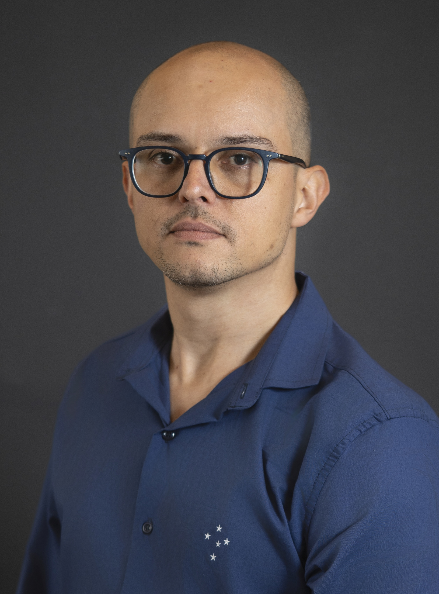

  

  
  

  

    
Olá! My name is Eric Araújo and I am currently an Associate Professor in the <a href="https://calvin.edu/academics/school-stem/computer-science">Computer Science Department</a> at <a href="https://calvin.edu/">Calvin University</a>

    
My research explores computational approaches to understanding human behavior and social dynamics. The main principle of my studies are the intention to contribute meaningfully to the common good through rigorous scholarship and ethical frameworks. I investigate the spread of opinions, sentiments, and behaviors in <b>complex systems</b> through <b>multiagent modeling and simulations</b>, offering insights into <b>social dynamics</b> across diverse domains including politics, cooperation, health, criminology, and religion.

  

  
At Calvin University, I teach courses in computer science, data science, and agent-based modeling, always emphasizing the integration of faith and learning. I am passionate about mentoring students in research that combines technical excellence with Christian values, preparing them for careers that serve both God and society.

---

## Academic Formation

**Ph.D. in Computer Science** (2018)  
[Vrije Universiteit Amsterdam](https://vu.nl/nl), The Netherlands  
*Dissertation: Computational modeling of social contagion processes*

**M.S. in Computer Science** (2009)  
[Federal University of Minas Gerais](https://ufmg.br/), Brazil  
*Focus: Computer Networks: Protocol TCP and its Applications*

**B.S. in Computer Science** (2007)  
[Federal University of Viçosa](https://www.ufv.br/), Brazil  
*Free Software Development and FPGA Applications*

---

## 🔬 Research & Scholarship

Most of my writings will be found in here. This page is permanently under construction, so if you want to have my whole body of publications in one place, I recommend going to my <a href="https://scholar.google.com/citations?user=QlE8JOoAAAAJ&hl=en&authuser=1">Google Scholar profile</a>.

You can also find my CV in Portuguese at <a href="http://lattes.cnpq.br/8108200264338612">Lattes CV</a>. Also, my social networks in English are <a href="https://www.researchgate.net/profile/Eric_Fernandes_De_Mello_Araujo">ResearchGate</a> and <a href="https://www.threads.net/@eric.araujo.phd?hl=en">Threads</a>.

My CV in English is available <a href="cv/Eric_Araujo_CV.pdf">in this link</a> and my <a href="https://orcid.org/0000-0003-4263-9075">ORCID</a>.

I have also created a <a href="https://www.youtube.com/EricAra%C3%BAjo">YouTube channel</a> during the 2020 pandemic to divulge my work as well as teaching resources on Agent-based modeling with Netlogo.

You can find my **PhD Thesis** in here: [Contagious: Modeling the spread of behaviours, perceptions and emotions in social networks](./files/Contagious_Eric_Araujo.pdf)

Please let me know if any links are not working, or if you need some of my papers and can't access them by <a href="mailto:eric.araujo@calvin.edu">emailing me</a>.

### Multidisciplinary Approach

My work bridges computer science with multiple domains, using computational tools to address real-world challenges:

**🙏 Community, Faith & Computational Modeling**: Understanding the main dynamics of faith communities through the use of computational models  
**🏛️ Political Science**: Modeling opinion dynamics and polarization in communities  
**🏥 Public Health**: Understanding behavior spread and intervention strategies  
**🛡️ Public Security**: Analyzing crime patterns through network topology  
**📱 Social Computing**: Investigating misinformation spread and social influence  
**🌱 Behavioral Change**: Promoting healthier lifestyles through computational insights

**Core Methodologies:**

- Agent-based modeling and simulation
- Complex network analysis
- Social dynamics modeling
- Cognitive behavioral frameworks
- Machine learning applications

---

## 📰 Recent Updates & Achievements

### 🚀 Call for Papers: AI & STEM Track Now Open

The call for papers for the **AI & STEM** track at the <a href="https://calvin.edu/faith-and-technology" target="_blank">Wisdom in the Age of AI Conference</a> is now open! Submissions are welcome at the intersection of artificial intelligence, emerging technologies, and Christianity.

Read the full Call for Papers and &rarr; [submit your work](faithandai/cfp-ai-stem.md)

:::{note} Latest Academic Activities
:class: dropdown

### Academic Service & International Collaboration

#### Masters Examination Committee

- **August 22, 2025**: Served as **External Committee Member** for Masters Exam of *Stephano Daniel Santos*
- **Supervision**: Under *Prof. Teodorico de Castro Ramalho* and *Prof. Danton Diego Ferreira* on **Agrochemistry**
- **Work title**: Enhancing Prediction Accuracy of Portland Cement Compressive Strength at Low Cost Using Machine Learning and Chemometric Techniques

### Recent Presentations (2025)

**American Scientific Affiliation Conference**  
*July 19, 2025* - Presented *Behavioral Insights into Political Polarization in Christian Communities through Computational Modeling* at [ASA 2025](https://network.asa3.org/mpage/ASA2025)  
📊 [View Full Presentation](https://ericaraujo.com/presentations/2025/ASA/presentation.html)

**International AI & Society Symposium**  
*May 28, 2025* - Participated in ["Algorithms, Democracy and Society: challenges and perspectives"](https://algoritmosesociedade.inf.ufg.br/#inicio) discussing education, AI and society (Portuguese)

### Recent Publications

**Journal of Complex Systems** (2025)  
[*Exploring the Link Between Urban Topology and Street Crime Using Complex Networks: A Case Study from Southeast Brazil*](https://doi.org/10.1093/comnet/cnaf016)  
*Co-supervised with Prof. Dr. Angelica de Sousa da Mata, developed by master's student Matheus Flausino*

**Brazilian Journal of Physics Teaching** (2024)  
[*The use of agent-based modeling in the study of complex systems*](https://doi.org/10.1590/1806-9126-RBEF-2024-0464) (Portuguese)  
*Result of Clayton R. da Silva's master's studies, in partnership with Prof. Angélica S. Mata*

### International Collaboration

**INSNA Sunbelt 2025 - Paris, France**  
Poster presentation: [Scientific Collaboration in Health and Life Sciences: A Study of Brazil's Contributions and Partnerships](https://www.conftool.pro/sunbelt2025/index.php?page=browseSessions&form_session=196#paperID891)  
*Collaboration with Fiocruz (Brazil) examining global health research networks*
:::

---

## 🔗 Explore More

:::{seealso} Academic Portfolio
**[📚 Publications](publications.md)** - Complete research publications organized by time period

**[🎤 Presentations](presentations.md)** - Conference talks and academic presentations  

**[🎓 Teaching](teaching.md)** - Course information and educational philosophy

**[👥 Advising](advising.md)** - Student mentorship and research supervision

**[📈 Updates](updates.md)** - Archived news and academic milestones
:::

---

*"There is not a square inch in the whole domain of our human existence over which Christ, who is Sovereign over all, does not cry: 'Mine!'"* - Abraham Kuyper
