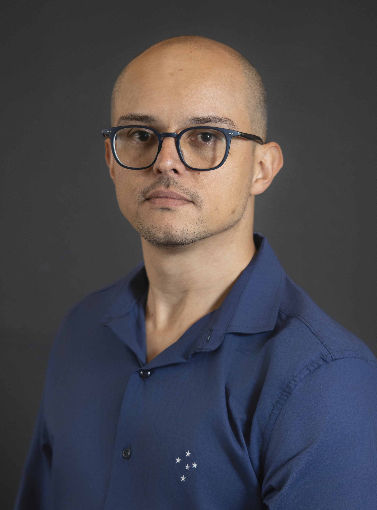

  

    
  

  

    
Olá! I am an Associate Professor in the <a href="https://calvin.edu/academics/school-stem/computer-science">Computer Science Department</a> at <a href="https://calvin.edu/">Calvin University</a>.

    
My research uses computational methods to understand human behavior and social dynamics — particularly the spread of opinions, sentiments, and behaviors through complex systems. I work with <strong>multiagent modeling and simulation</strong> across domains including political polarization, public health, urban security, and religious communities.

    
At Calvin, I teach courses in computer science, data science, and agent-based modeling. I enjoy mentoring students in research that takes both technical rigor and ethical reflection seriously.

  

---

## Academic Formation

**Ph.D. in Computer Science** (2018) — [Vrije Universiteit Amsterdam](https://vu.nl/nl), The Netherlands  
*Dissertation: Computational modeling of social contagion processes*

**M.S. in Computer Science** (2009) — [Federal University of Minas Gerais](https://ufmg.br/), Brazil

**B.S. in Computer Science** (2007) — [Federal University of Viçosa](https://www.ufv.br/), Brazil

---

## Research & Scholarship

My work bridges computer science and the social sciences, applying agent-based modeling and complex network analysis to questions of social dynamics. Active domains include political opinion formation, crime network topology, epidemiological behavior spread, and computational modeling of religious communities.

Core methodologies: agent-based modeling and simulation, complex network analysis, social dynamics modeling, cognitive behavioral frameworks, and machine learning applications.

You can find the full publication list on this site or on my [Google Scholar profile](https://scholar.google.com/citations?user=QlE8JOoAAAAJ&hl=en&authuser=1). My CV in English is [available here](cv/Eric_Araujo_CV.pdf), and my [ORCID](https://orcid.org/0000-0003-4263-9075) and [Lattes CV](http://lattes.cnpq.br/8108200264338612) (Portuguese) are also linked. I also have a [YouTube channel](https://www.youtube.com/EricAra%C3%BAjo) with teaching resources on agent-based modeling with NetLogo.

My PhD thesis: [*Contagious: Modeling the spread of behaviours, perceptions and emotions in social networks*](./files/Contagious_Eric_Araujo.pdf)

If any links are broken or you need a paper you cannot access, please [email me](mailto:eric.araujo@calvin.edu).

---

## Recent News

<!-- NEWS_START -->

**July 1, 2026** — [NetLogo Conference 2026 — Cognitive Modeling of Church Polarization](https://conference.netlogo.org/2026/cfp)  
Students Katelin Jandris, Ryan Klein, and Ovgu Tufan will present *Cognitive Modeling of Church Polarization* at the NetLogo Conference 2026 in Chicago, July 2026.

**May 1, 2026** — [Nagel Institute Fellowship](https://nagelinstitute.org/fellowships/)  
Awarded a Nagel Institute Fellowship for the Study of World Christianity at Calvin University, supporting research on computational modeling of world Christian communities.

**May 1, 2026** — [McGregor Undergraduate Research Fellowship](https://calvin.edu/faculty-development-research/student-research-opportunities/mcgregor-undergraduate-research-program)  
Awarded a McGregor Undergraduate Research Fellowship at Calvin University, supporting collaborative faculty-student research.

**February 27, 2026** — [Baylor Symposium on Faith & Culture 2026](https://ifl.web.baylor.edu/conferences-and-symposiums/baylor-symposium-faith-and-culture/2026-technology-and-human-person-3)  
Presented *A Framework for Modeling Christian Communities with Agent-Based Models* at the Baylor Symposium on Faith & Culture 2026 — Technology and the Human Person in the Age of AI. Waco, TX.

**February 1, 2026** — [Quantitative Science Studies — Brain Drain to Brain Circulation](https://doi.org/10.1162/QSS.a.411)  
Published: *From brain drain to brain circulation: International researcher mobility in Brazilian health and life sciences (2005–2020)*. Quantitative Science Studies. With Leonardo Biazoli, Priscila Albuquerque, and team (Fiocruz).

**August 22, 2025** — **Masters Exam Committee (UFLA Brazil)**  
Served as external committee member for the Masters Exam of Stephano Daniel Santos, on machine learning for prediction of Portland cement compressive strength (advisors: Profs. Teodorico de Castro Ramalho and Danton Diego Ferreira).

[See all past updates →](updates.md)

<!-- NEWS_END -->

---

> *"There is not a square inch in the whole domain of our human existence over which Christ, who is Sovereign over all, does not cry: 'Mine!'"* — Abraham Kuyper
