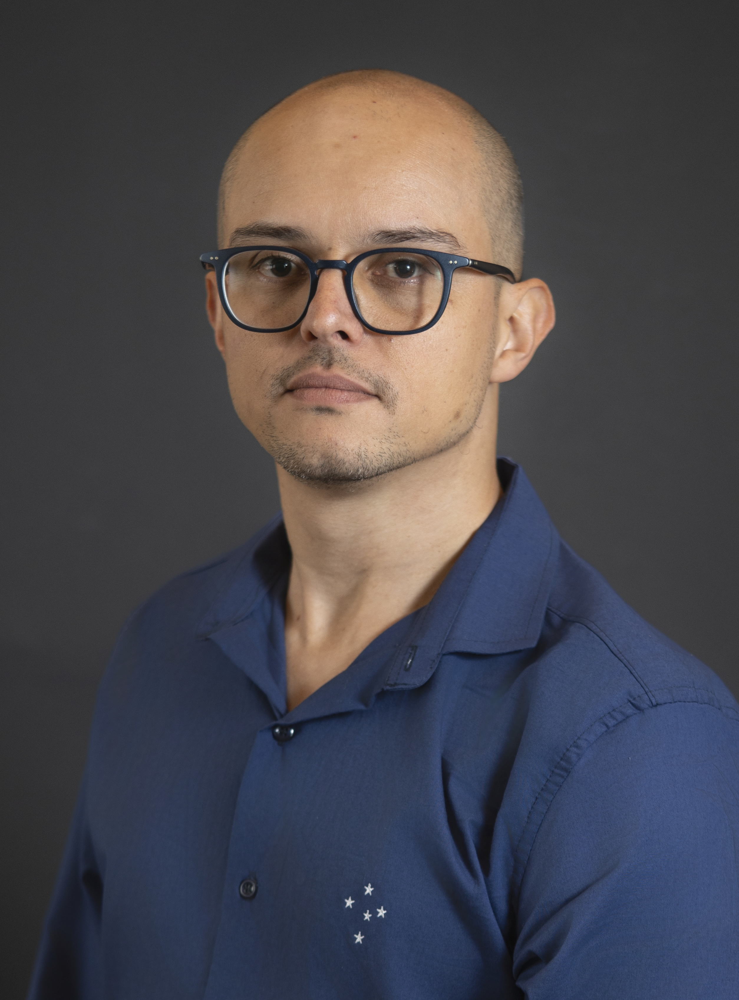

::: {.home-hero}
{.home-hero-photo}

# Eric Araújo

Olá! I am an Associate Professor in the [Computer Science Department](https://calvin.edu/academics/school-stem/computer-science) at [Calvin University](https://calvin.edu/).

My research uses computational methods to understand human behavior and social dynamics — particularly the spread of opinions, sentiments, and behaviors through complex systems. I work with **multiagent modeling and simulation** across domains including political polarization, public health, urban security, and religious communities.

At Calvin, I teach courses in computer science, data science, and agent-based modeling. I enjoy mentoring students in research that takes both technical rigor and ethical reflection seriously.

::: {.hero-links}
[Email](mailto:eric.araujo@calvin.edu) [CV](cv/Eric_Araujo_CV.pdf) [Google Scholar](https://scholar.google.com/citations?user=QlE8JOoAAAAJ&hl=en&authuser=1) [ORCID](https://orcid.org/0000-0003-4263-9075) [Lattes](http://lattes.cnpq.br/8108200264338612) [YouTube](https://www.youtube.com/EricAra%C3%BAjo)
:::
:::

---

::: {.bento-grid}

::: {.bento-card .bento-news}
### Recent News

<!-- NEWS_START -->

**July 1, 2026** — [NetLogo Conference 2026 — Cognitive Modeling of Church Polarization](https://conference.netlogo.org/2026/cfp)  
Students Katelin Jandris, Ryan Klein, and Ovgu Tufan will present *Cognitive Modeling of Church Polarization* at the NetLogo Conference 2026 in Chicago, July 2026.

**June 1, 2026** — [Revista Brasileira de Segurança Pública — Temporal Characterization of Street Robberies](https://doi.org/10.31060/rbsp.2026.v20.n2.2081)  
Published: *Caracterização Temporal de Roubos de Rua Contrastando Contextos Pré-Pandêmico e Pandêmico*. Revista Brasileira de Segurança Pública, v. 20, n. 2, p. 54–81. With Renato Figueiredo Frade, João Paulo Roquim Romanelli, and Carlos Henrique da Silveira (UNIFEI).

**May 1, 2026** — [Calvin Research Fellowship](https://calvin.edu/faculty-development-research/faculty-research-opportunities/calvin-research-fellowships)  
Awarded a Calvin Research Fellowship (2026/2027) supporting research on computational modeling of Christian communities.

**May 1, 2026** — [Nagel Institute Fellowship](https://nagelinstitute.org/fellowships/)  
Awarded a Nagel Institute Fellowship for the Study of World Christianity at Calvin University, supporting research on computational modeling of world Christian communities.

**May 1, 2026** — [McGregor Undergraduate Research Fellowship](https://calvin.edu/faculty-development-research/student-research-opportunities/mcgregor-undergraduate-research-program)  
Awarded a McGregor Undergraduate Research Fellowship at Calvin University, supporting collaborative faculty-student research.

**February 27, 2026** — [Baylor Symposium on Faith & Culture 2026](https://ifl.web.baylor.edu/conferences-and-symposiums/baylor-symposium-faith-and-culture/2026-technology-and-human-person-3)  
Presented *A Framework for Modeling Christian Communities with Agent-Based Models* at the Baylor Symposium on Faith & Culture 2026. Waco, TX.

[See all past updates →](updates.md)

<!-- NEWS_END -->
:::

::: {.bento-card .bento-formation}
### Formation

**Ph.D.** Computer Science · 2018  
[Vrije Universiteit Amsterdam](https://vu.nl/nl)  
*Computational modeling of social contagion*

**M.S.** Computer Science · 2009  
[Federal University of Minas Gerais](https://ufmg.br/)

**B.S.** Computer Science · 2007  
[Federal University of Viçosa](https://www.ufv.br/)
:::

::: {.bento-card .bento-research}
### Research & Scholarship

My work bridges computer science and the social sciences, applying agent-based modeling and complex network analysis to questions of social dynamics. Active domains include political opinion formation, crime network topology, epidemiological behavior spread, and computational modeling of religious communities.

Core methodologies: agent-based modeling and simulation, complex network analysis, social dynamics modeling, cognitive behavioral frameworks, and machine learning applications.

[Google Scholar](https://scholar.google.com/citations?user=QlE8JOoAAAAJ&hl=en&authuser=1) · [ORCID](https://orcid.org/0000-0003-4263-9075) · [PhD thesis](./files/Contagious_Eric_Araujo.pdf)
:::

::: {.bento-card .bento-quote}
> *"There is not a square inch in the whole domain of our human existence over which Christ, who is Sovereign over all, does not cry: 'Mine!'"*
>
> — Abraham Kuyper
:::

:::
